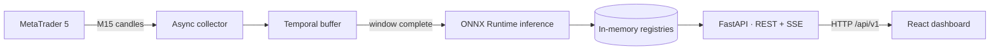

# FinKAN

[](https://github.com/iuryhattori/FinKAN/actions/workflows/ci.yml)


**FinKAN is an end-to-end, real-time stock prediction platform.** It collects PETR4 market data from MetaTrader 5, runs inference with a KAN-based time-series model exported to ONNX, and streams continuous predictions to a React dashboard — all built on a decoupled, Clean Architecture-inspired design.

The project demonstrates how a Machine Learning model goes from training notebook to production-style serving: data ingestion, temporal buffering, low-latency ONNX inference, a typed REST/SSE API, and a frontend that consumes it over HTTP with no coupling to the backend internals.



## Why FinKAN

- **Real-time inference pipeline** — asynchronous candle collection with retry/backoff, temporal buffering, and prediction as soon as the input window completes.
- **Production-minded ML serving** — the model is exported to ONNX and served with ONNX Runtime on CPU; the scaler is versioned alongside the model artifact and loaded once at startup (fail-fast).
- **Decoupled by contract** — the frontend only knows four HTTP endpoints; backend internals can change freely. Ports & adapters separate domain, application, and infrastructure.
- **Replayable test mode** — `mt5_mode: test` replays historical candles in chronological order, so the full pipeline runs even with the market closed.
- **Tested and CI-backed** — 47 pytest tests (buffers, registries, adapters, retry logic, ONNX predictor, API contract) running on GitHub Actions.

## Getting Started

### Prerequisites

- Windows (the official `MetaTrader5` Python package ships Windows-only wheels)
- Python 3.10+
- Node.js 20+
- MetaTrader 5 installed, with a valid broker account
- GPU is **only** required for training — serving and the dashboard run on CPU

### 1. Clone and install the backend

```powershell
git clone https://github.com/iuryhattori/FinKAN.git
cd FinKAN
python -m venv .venv
.\.venv\Scripts\Activate.ps1
pip install -r requirements.txt
```

### 2. Configure MT5 credentials

Create `backend/.env` with your broker credentials:

```env
LOGIN=12345678
PASSWORD=your-password
SERVER=YourBroker-Server
```

Runtime behavior lives in [backend/config/config.yaml](backend/config/config.yaml) — notably `mt5_mode` (`test` replays history; `live` follows the market) and the model hyperparameters.

### 3. Run the API

```powershell
cd backend
uvicorn main:app --port 8000
```

On startup the app loads the ONNX model and scaler, connects to MetaTrader 5, and begins collecting. After the first full window (~20 s in test mode) you will see `Predição registrada para PETR4` in the log.

### 4. Run the dashboard

```powershell
cd frontend
npm install
npm run dev
```

Open <http://localhost:5173>. In development, Vite proxies `/api` to `localhost:8000` (no CORS setup needed); for production builds, point `VITE_API_BASE_URL` to the deployed API (see [frontend/.env.example](frontend/.env.example)).

### 5. Run the tests

```powershell
pip install -r requirements-dev.txt
pytest
```

## API Overview

| Endpoint | Description |
|---|---|
| `GET /health` | Liveness and app-context status |
| `GET /api/v1/candles/latest` | Most recent collected candle (OHLCV + symbol + date) |
| `GET /api/v1/candles/history?limit=N` | Last N candles, oldest to newest |
| `GET /api/v1/predictions/latest` | Latest model prediction (OHLC, 1-hour horizon) |
| `GET /api/v1/stream` | Server-Sent Events stream of candles + predictions |
| `POST /stop` | Gracefully stops data collection |

Endpoints return `404` while the first window is still being collected — the dashboard treats this as a loading state, not an error.

## Training Flow

```powershell
cd backend
python entrypoint/run_model.py   # trains, evaluates and exports the model
python entrypoint/run_plot.py    # plots predicted vs. realized values
```

Training reads [backend/config/config.yaml](backend/config/config.yaml), saves checkpoints to `artifacts/checkpoints/`, and exports the final model and its fitted scaler together to `backend/onnx/prediction_1h/` — the exact artifacts the serving path loads.

## Project Structure

```text
FinKAN/
├── .github/workflows/      # CI (pytest on windows-latest)
├── backend/
│   ├── config/              # Runtime + training configuration
│   ├── entrypoint/          # Training and plotting scripts
│   ├── onnx/                # Exported model + scaler artifacts
│   ├── src/
│   │   ├── domain/          # Entities, value objects, contracts
│   │   ├── application/     # Use cases, ports
│   │   ├── infrastructure/  # MT5 sources, buffers, ONNX predictor, factory
│   │   ├── presentation/    # FastAPI controllers and schemas
│   │   └── pipeline/        # Model, dataloaders, training experiments
│   └── tests/               # pytest suite (47 tests)
├── frontend/
│   └── src/
│       ├── services/        # HTTP client + API service layer
│       ├── schemas/         # DTO → UI model mappers
│       ├── hooks/           # useMarketData (REST bootstrap + SSE)
│       └── features/        # Dashboard components
├── pyproject.toml
└── README.md
```

Key files to start reading: [backend/main.py](backend/main.py) (app lifecycle), [backend/src/infrastructure/factory/app_factory.py](backend/src/infrastructure/factory/app_factory.py) (dependency composition), [backend/src/application/use_cases/prediction_manager.py](backend/src/application/use_cases/prediction_manager.py) (inference orchestration), and [frontend/src/hooks/connection_hook.jsx](frontend/src/hooks/connection_hook.jsx) (how the UI consumes the API).

## Roadmap

- Event bus replacing the SSE polling loop
- Server-side prediction history endpoint
- Experiment tracking (MLflow) and a simple model registry
- Prometheus metrics and drift detection
- Partial Docker support (API in replay mode; MT5 is Windows-only)

## Getting Help

- Open an [issue](https://github.com/iuryhattori/FinKAN/issues) for bugs or questions
- Check the [CI runs](https://github.com/iuryhattori/FinKAN/actions) for the expected green-state of the test suite

## Maintainer & Contributing

Issues and pull requests are welcome — please run `pytest` and `npm run lint` before submitting.
